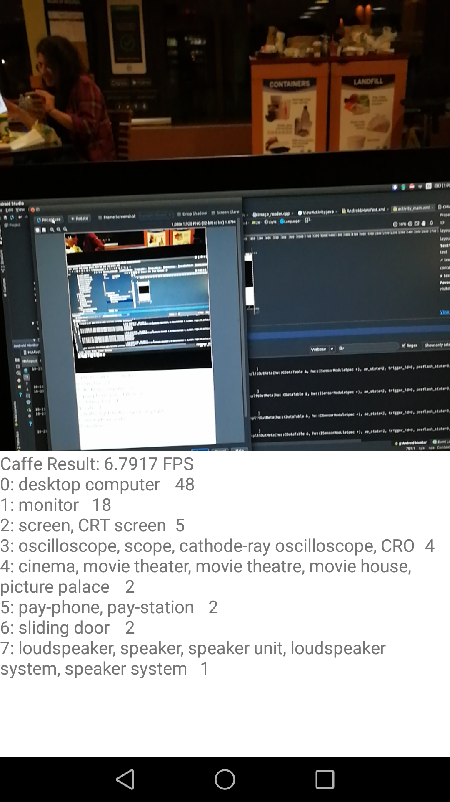

# caffe2-android-ndk-camera
Integrate Caffe2, OpenCV with Android NDK camera

This project put Android NDK camera, OpenCV, and Caffe2 together.

Source code is based on,

[1] [NDK camera texture-view sample code](https://github.com/googlesamples/android-ndk/tree/master/camera)

[2] [Caffe2 example code](https://github.com/leonardvandriel/caffe2_cpp_tutorial/blob/master/src/caffe2/binaries/pretrained.cc)

[3] [AIcamera caffe2 libraries](https://github.com/bwasti/AICamera)

[4] [OpenCV android sample](https://github.com/opencv/opencv/tree/master/samples/android)

## Screenshots
-----------

As my first Android App, I want it to be simple, and fast. Efficiency is the goal of this simple App.
Any comments and suggestions are helpful.
